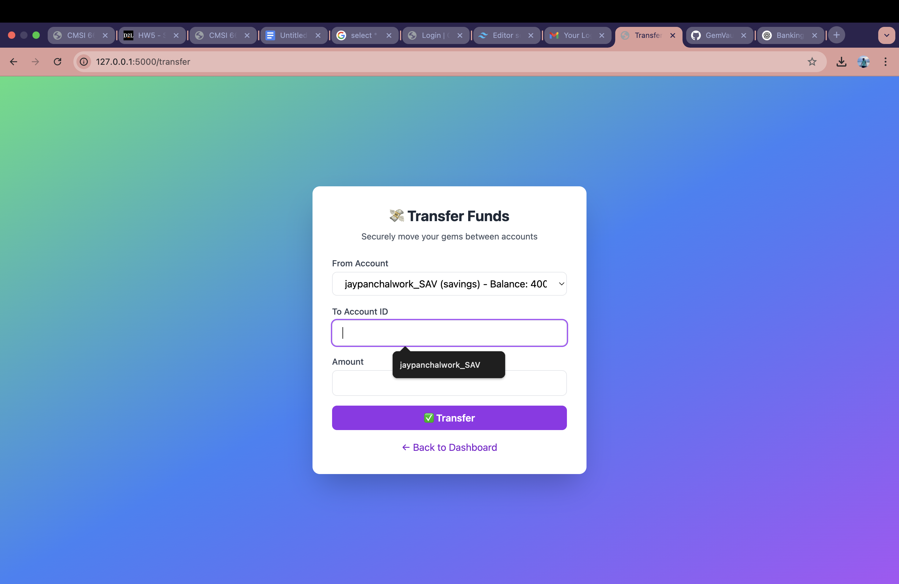

# Secure Bank Web App

Welcome to **Secure Bank**, a security-focused web application built with Flask. This app simulates online banking functionality while integrating modern security best practices to defend against common web vulnerabilities.

---

## 🎓 Project Overview

Secure Bank allows users to:

* Register and choose account types (checking, savings, or both)
* Log in with email/password and OTP-based MFA
* View account balances
* Transfer funds between accounts
* Recover accounts via secure password reset

---

## 🔐 Security Features Implemented

### 1. **Password Hashing**

* Uses `passlib.hash.pbkdf2_sha256` to securely hash passwords before storing in the database.
* Prevents password theft even if database is compromised.

### 2. **CSRF Protection**

* Enabled site-wide using `flask-wtf`'s `CSRFProtect`.
* All forms include hidden CSRF tokens to prevent cross-site request forgery attacks.

### 3. **XSS Defense**

* All user inputs are validated server-side.
* Jinja2 auto-escapes all variables in HTML templates.

### 4. **SQL Injection Defense**

* All SQL queries use parameterized statements (i.e., `?` placeholders).

### 5. **MFA (Multi-Factor Authentication)**

* Users receive a 6-digit One-Time Password (OTP) via email upon login.
* Only after successful OTP verification, a JWT auth token is issued.

### 6. **JWT Authentication**

* After login, an `auth_token` is issued and stored in a cookie.
* JWT is signed with a secret key and has a 60-minute expiration.

### 7. **User Enumeration Prevention**

* Login and password reset pages return the same message whether or not a user exists.
* Prevents attackers from probing for valid email accounts.

### 8. **Timing-Safe Password Checks**

* Password comparison uses secure `verify()` from passlib.
* Can be extended using `hmac.compare_digest` for enhanced protection.

---

## 🎓 Technologies Used

* **Backend:** Flask (Python)
* **Database:** SQLite
* **Security:** passlib, pyotp, flask-wtf, flask-mail, JWT (PyJWT)
* **Frontend:** HTML, Jinja2, CSS (minimal)

---

## ⚖️ How to Run Locally

### 1. Clone the repository

```bash
git clone https://github.com/your-username/secure-bank
cd secure-bank
```

### 2. Set up a virtual environment

```bash
python3 -m venv venv
source venv/bin/activate
pip install -r requirements.txt
```

### 3. Initialize the database

```bash
python update_schema.py
```

### 4. Run the Flask app

```bash
flask run
```

Visit `http://127.0.0.1:5000` in your browser.

---

## 🔹 Sample Test User

* Email: `testuser@example.com`
* Password: `testpass123`

Check your inbox for a 6-digit OTP after login.

---

## 💼 Credits

Developed by **Jay A Panchal** as part of a Secure Software Development course at Loyola Marymount University. Inspired by best practices taught in-class and OWASP recommendations.

---

## 🌈 Fun Features

* Accounts track assets like **gems** or **carbon credits**.
* Optional visual themes and animations on transfer.

---

## 📈 Future Improvements

* QR-based MFA (Google Authenticator support)
* Logging dashboard for account activities
* Admin panel with role-based access

---

> *"Security is not a feature; it's a habit."*

---

## ✨ Screenshots

## 🔐 Login Page

A beautifully styled login form with OTP-based authentication and CSRF protection.

## 💎 Dashboard

Displays user's account type, balance, and secure links to transfer funds or view details.

## 🔍 Account Details

Securely shows account number and balance. Page is protected against user enumeration and SQL injection.

## 🔄 Transfer Funds

Lets users move funds between accounts with real-time validation and secure checks.

## 🔁 OTP Verification

MFA system with 6-digit OTP emailed on login—adds a strong security layer.

## 🔑 Forgot Password

Password reset system with tokenized email link and secure update process.
